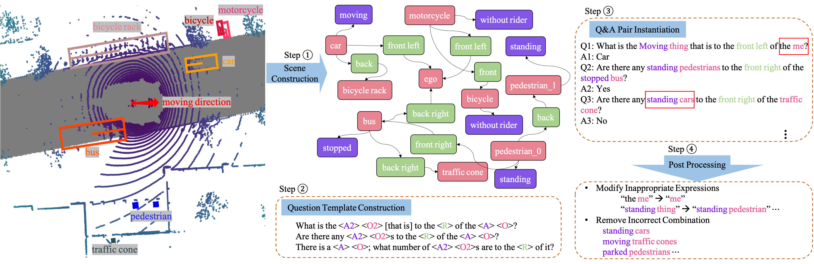

# [AAAI 2024] NuScenes-QA

Official repository for the AAAI 2024 paper **[NuScenes-QA: A Multi-modal Visual Question Answering Benchmark for Autonomous Driving Scenario](https://arxiv.org/pdf/2305.14836.pdf)**.



## :fire: News

- `2024.11.01`  CenterPoint feature released. 
- `2024.10.11`  Training and Testing code released.
- `2023.12.09`  Our paper is accepted by AAAI 2024! 
- `2023.09.04`  Our NuScenes-QA dataset v1.0 released.

## :hourglass_flowing_sand: To Do

- [x] Release question & anwswer data
- [x] Release visual feature
- [x] Release training and testing code

## :running: Getting Started

### Data Preparation

We have released our question-answer annotations, please download it from [HERE](https://drive.google.com/drive/folders/1jIkICT23wZWZYPrWCa0x-ubjpClSzOuU?usp=sharing).

For the visual data, you can download **CenterPoint** feature that we have extracted from [HERE](https://drive.google.com/file/d/1TNsK6cpQ4pd9fH1s7WFxTSXilrT2uNYb/view?usp=sharing). As an alternative, you can also download the origin nuScenes dataset from [HERE](https://www.nuscenes.org/download), and extract the object-level features refer to this [LINK](https://mmdetection3d.readthedocs.io/en/v0.16.0/datasets/nuscenes_det.html) with different backbones. For specific details on feature extraction, you can refer to the **Visual Feature Extraction** and **Object Embedding** sections of our paper.

The folder structure should be organized as follows before training.

```
NuScenes-QA
+-- configs/
|   +-- butd.yaml                    
|   +-- mcan_small.yaml
+-- data/
|   +-- questions/				# downloaded
|   |   +-- NuScenes_train_questions.json
|   |   +-- NuScenes_val_questions.json
|   +-- features/ 				# downloaded or extracted
|   |   +-- CenterPoint/
|   |   |   +-- xxx.npz
|   |   |   +-- ...
|   |   +-- BEVDet/
|   |   |   +-- xxx.npz
|   |   |   +-- ...
|   |   +-- MSMDFusion/
|   |   |   +-- xxx.npz
|   |   |   +-- ...
+-- src/
+-- run.py
```

### Installation

The following packages are required to build the project:

```bash
python >= 3.5
CUDA >= 9.0
PyTorch >= 1.4.0
SpaCy == 2.1.0
```

For the SpaCy, you can install it by:

```bash
wget https://github.com/explosion/spacy-models/releases/download/en_core_web_lg-2.1.0/en_core_web_lg-2.1.0.tar.gz
pip install en_core_web_lg-2.1.0.tar.gz
```

### Training 

The following script will start training a `man_small` model with `CenterPoint` feature on `2` GPUs:

```bash
python3 run.py --RUN='train' --MODEL='mcan_small' --VIS_FEAT='CenterPoint' --GPU='0, 1'
```

All checkpoint files and the training logs will be saved to the following paths respectively:

```bash
outputs/ckpts/ckpt_<VERSION>/epoch<EPOCH_INDEX>.pkl
outputs/log/log_run_<VERSION>.txt
```

### Testing

For testing, you can use the following script:

```bash
python3 run.py --RUN='val' --MODEL='mcan_small' --VIS_FEAT='CenterPoint' --CKPT_PATH'path/to/ckpt.pkl'
```

The evaluation results and the answers for all questions will ba saved to the following paths respectively:

```bash
outputs/log/log_run_xxx.txt
outputs/result/result_run_xxx.txt
```

## :star: Others
If you have any questions about the dataset and its generation or the object-level feature extraction, feel free to cantact me with `twqian19@fudan.edu.cn`.


## :book: Citation
If you find our paper and project useful, please consider citing:
```bibtex
@article{qian2023nuscenes,
  title={NuScenes-QA: A Multi-modal Visual Question Answering Benchmark for Autonomous Driving Scenario},
  author={Qian, Tianwen and Chen, Jingjing and Zhuo, Linhai and Jiao, Yang and Jiang, Yu-Gang},
  journal={arXiv preprint arXiv:2305.14836},
  year={2023}
}
```

## Acknowlegement

We sincerely thank the authors of [MMDetection3D](https://github.com/open-mmlab/mmdetection3d) and [OpenVQA](https://github.com/MILVLG/openvqa) for open sourcing their methods.

